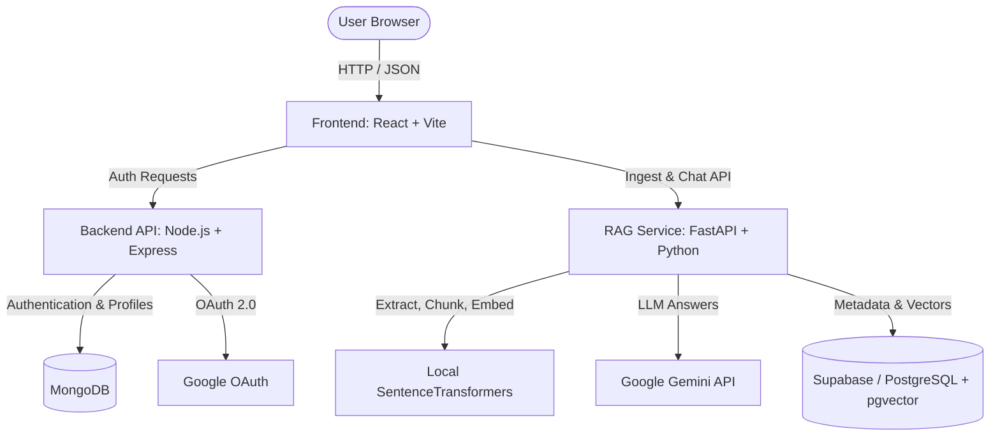

# RagMatrix 🧠⚡

RagMatrix is a professional-grade, multi-tenant Retrieval-Augmented Generation (RAG) platform designed to let users upload PDFs and engage in secure, isolated chat conversations with their documents. 

The system leverages local embedding generation, PostgreSQL with `pgvector` for efficient similarity searching, and Google Gemini models for context-aware question answering—wrapped in a beautiful, modern user interface.

---

## 🏗️ System Architecture

RagMatrix utilizes a modern three-tier architecture:



### 1. Frontend (`/frontend`)
- **Framework:** React 19 + Vite.
- **Styling:** Premium dark-themed, glassmorphic layout with custom responsive navbar, landing, signup/login, dashboard, and chat page.
- **State & Routing:** Client-side routing with `react-router-dom` and user session handling.

### 2. Authentication Server (`/backend`)
- **Runtime:** Node.js + Express.js.
- **Database:** MongoDB (using Mongoose) for user identity persistence.
- **Security:** Local login (bcryptjs-hashed passwords) & JWT session tokens + Google OAuth 2.0 (via Passport.js).

### 3. Model & RAG Service (`/model`)
- **Runtime:** FastAPI + Python 3.12.
- **Extraction:** PyMuPDF (`fitz`) for fast, local PDF extraction.
- **Chunking:** `RecursiveCharacterTextSplitter` from LangChain (chunk size: 800, overlap: 100).
- **Embeddings:** Local `multi-qa-MiniLM-L6-cos-v1` via `SentenceTransformer` (supports ONNX runtime acceleration).
- **Vector Database:** PostgreSQL with `pgvector` extension for storing and querying text embeddings.
- **LLM Engine:** Gemini 3.5 Flash (`google-genai`) for answer generation.

---

## 🔒 Multi-Tenant Data Isolation

RagMatrix implements strict security policies to isolate files and chats between users:
* **Scope Verification:** Every retrieval query and PDF ingestion is mapped to a specific `user_id`.
* **Ownership Checks:** Before querying documents or accessing chat history, the FastAPI backend verifies the requesting `user_id` owns the `document_id` via the `user_documents` table. Unauthorized requests return a `403 Forbidden` error.

---

## 🛠️ Database Schema

### MongoDB (User Management)
```javascript
{
  username: { type: String, required: true },
  email: { type: String, unique: true, required: true },
  password: { type: String }, // Present for local auth
  googleId: { type: String }, // Present for Google OAuth
  authProvider: { type: String, enum: ["local", "google"], required: true }
}
```

### PostgreSQL / Supabase (Vector Store & Logs)
The FastAPI startup automatically initializes the schema if it does not exist:

1. **`user_documents`**: Links documents to users.
   - `id`: SERIAL PRIMARY KEY
   - `user_id`: TEXT NOT NULL
   - `document_id`: TEXT NOT NULL UNIQUE
   - `file_name`: TEXT NOT NULL
   - `created_at`: TIMESTAMP DEFAULT NOW()

2. **`chat_logs`**: Persists conversation history scoped to users and documents.
   - `id`: SERIAL PRIMARY KEY
   - `user_id`: TEXT NOT NULL
   - `document_id`: TEXT NOT NULL
   - `question`: TEXT NOT NULL
   - `answer`: TEXT NOT NULL
   - `created_at`: TIMESTAMP DEFAULT NOW()

3. **`document_chunks`**: Stores vector embeddings.
   - `document_id`: TEXT
   - `chunk_index`: INTEGER
   - `content`: TEXT
   - `embedding`: vector(384) *(Requires `pgvector` extension)*

---

## 🚀 Getting Started

### Prerequisites
- Node.js (v18+)
- Python (v3.12+)
- Running MongoDB instance (Local or Atlas)
- Running PostgreSQL database with the `pgvector` extension enabled.

---

### 1. Environment Configurations

Create `.env` files in respective folders:

#### Backend (`/backend/.env`)
```env
PORT=8080
MONGO_URI=mongodb+srv://<username>:<password>@cluster.mongodb.net/ragmatrix
JWT_key=your_secret_jwt_key
GOOGLE_CLIENT_ID=your_google_oauth_client_id
GOOGLE_CLIENT_SECRET=your_google_oauth_client_secret
```

#### FastAPI Model Service (`/model/.env`)
```env
DATABASE_URL=postgresql://postgres:<password>@<db-host>:5432/postgres
GEMINI_API_KEY=AIzaSy...
```

---

### 2. Backend Installation & Run
```bash
cd backend
npm install
npm run server
```
*Runs on `http://localhost:8080`*

### 3. Model Engine Installation & Run
We recommend setting up a virtual environment:
```bash
cd model
python3 -m venv myenv
source myenv/bin/activate
pip install -r requirements.txt
uvicorn main:app --host 127.0.0.1 --port 8000 --reload
```
*Runs on `http://localhost:8000`*

#### CLI Interrogator Utility
You can also run a local interactive CLI script to test document ingestion and chat directly in your terminal:
```bash
python chat.py <path-to-pdf>
```

### 4. Frontend Installation & Run
```bash
cd frontend
npm install
npm run dev
```
*Vite dev server will launch on `http://localhost:5173`*

---

## 🔌 API Endpoints

### Auth Server (Node.js/Express)
| Method | Endpoint | Description | Auth Required |
| :--- | :--- | :--- | :--- |
| `POST` | `/api/v1/auth/register` | Register new local user | No |
| `POST` | `/api/v1/auth/login` | Authenticate local user & receive JWT cookie | No |
| `GET` | `/api/v1/auth/me` | Fetch active user profile from token | Yes |
| `GET` | `/api/v1/auth/google` | Trigger Google OAuth flow | No |

### RAG Service (FastAPI)
| Method | Endpoint | Description | Query Parameters / Body |
| :--- | :--- | :--- | :--- |
| `POST` | `/api/ingest` | Process a PDF file, generate embeddings, and store them | Form-data: `file`, `document_id`, `user_id` |
| `POST` | `/api/chat` | Query document chunks and generate LLM answer | JSON: `{ "question", "document_id", "user_id" }` |
| `GET` | `/api/documents/{user_id}` | Fetch all documents owned by user | Path parameter: `user_id` |
| `GET` | `/api/chats/{user_id}` | Retrieve chat logs for user (optionally scoped to doc) | Path parameter: `user_id`, Query: `document_id` (optional) |
| `GET` | `/health` | Service health status | None |
